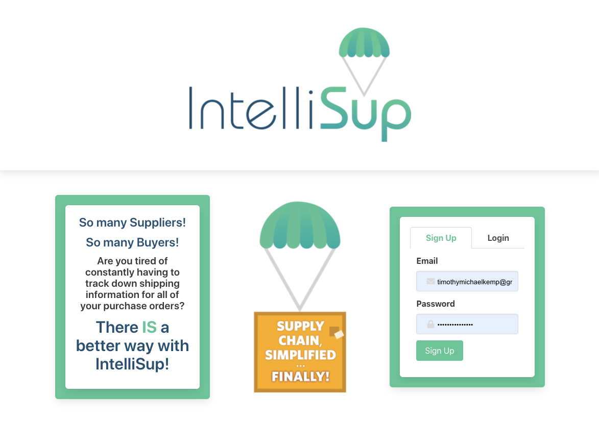
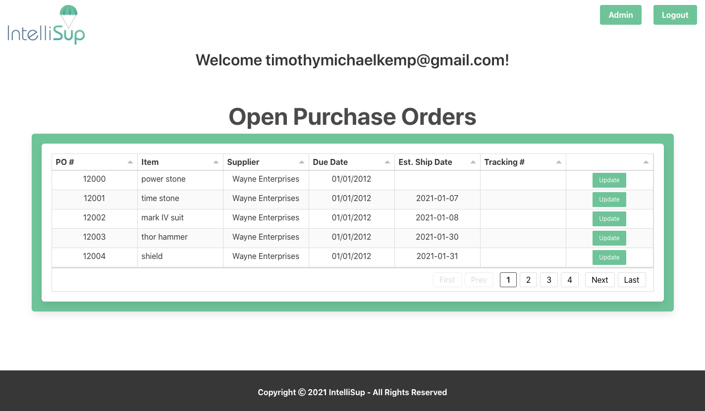
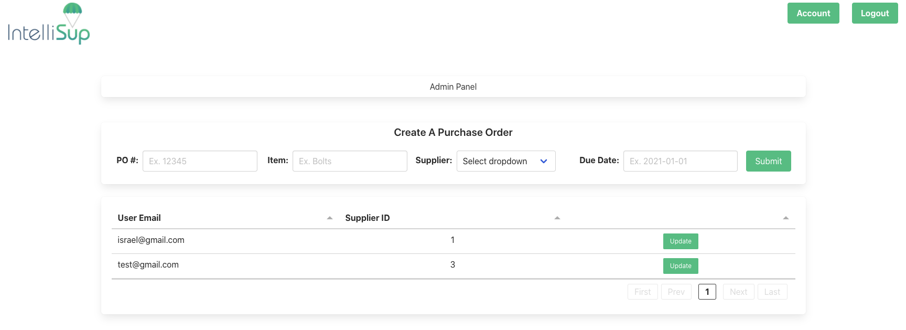

# IntelliSup

## Table of Contents

- [Description](#desciption)
- [Installation](#installation)
- [Usage](#Usage)
- [Contribution](#Contribution)
- [Test](#test)
- [License](#license)

## Description

This program is the perfect application any of your supplier needs. The application is designed to allow user to make a new purchase order from suppliers. This order is then submitted into the database and displayed in the front end for the user to confirm information submitted. The application also allows the user to update tracking information and estimated ship date for each product.

## License

 
None

## Installation

npm i

## Usage

Application is deployed and live.

## Contribution

## Test

## For any additional questions please contact me at:

GitHub: [IsraelGuillermo](https://github.com/IsraelGuillermo)
GitHub: [mattyparty](https://github.com/mattyparty)
GitHub: [timothykemp](https://github.com/timothykemp)
GitHub: [mahbub798](https://github.com/mahbub798)
